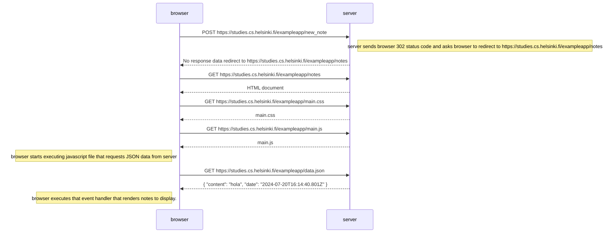

```mermaid
sequenceDiagram
    participant B as browser
    participant S as server

    B->>S: POST https://studies.cs.helsinki.fi/exampleapp/new_note
    Note right of S: server sends browser 302 status code and asks browser to redirect to https://studies.cs.helsinki.fi/exampleapp/notes
    S-->>B: No response data redirect to https://studies.cs.helsinki.fi/exampleapp/notes
    B->>S: GET https://studies.cs.helsinki.fi/exampleapp/notes
    S-->>B: HTML document
    B->>S: GET https://studies.cs.helsinki.fi/exampleapp/main.css
    S-->>B: main.css
    B->>S:  GET https://studies.cs.helsinki.fi/exampleapp/main.js
    S-->>B: main.js
    Note left of B: browser starts executing javascript file that requests JSON data from server
    B->>S:  GET https://studies.cs.helsinki.fi/exampleapp/data.json
    S-->>B:  { "content": "hola", "date": "2024-07-20T16:14:40.801Z" }
    Note left of B: browser executes that event handler that renders notes to display.
    
```