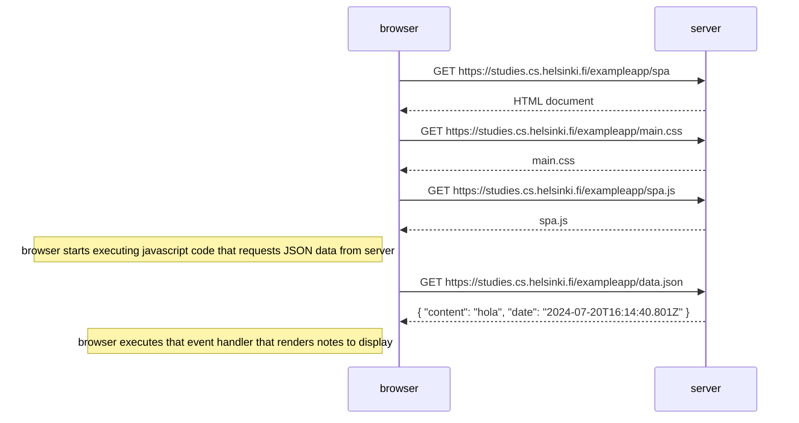

```mermaid
sequenceDiagram
participant B as browser
participant S as server

B->>S: GET https://studies.cs.helsinki.fi/exampleapp/spa
S-->>B: HTML document
B->>S: GET https://studies.cs.helsinki.fi/exampleapp/main.css
S-->>B: main.css
B->>S: GET https://studies.cs.helsinki.fi/exampleapp/spa.js
S-->>B: spa.js
Note left of B: browser starts executing javascript code that requests JSON data from server
B->>S: GET https://studies.cs.helsinki.fi/exampleapp/data.json
S-->>B: { "content": "hola", "date": "2024-07-20T16:14:40.801Z" }
Note left of B: browser executes that event handler that renders notes to display
```