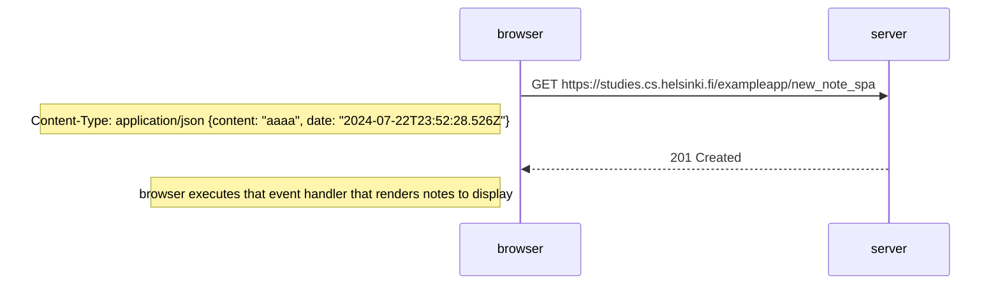

```mermaid
sequenceDiagram
participant B as browser
participant S as server

B->>S: GET https://studies.cs.helsinki.fi/exampleapp/new_note_spa
Note left of B: Content-Type: application/json {content: "aaaa", date: "2024-07-22T23:52:28.526Z"}
S-->>B: 201 Created
Note left of B: browser executes that event handler that renders notes to display
```